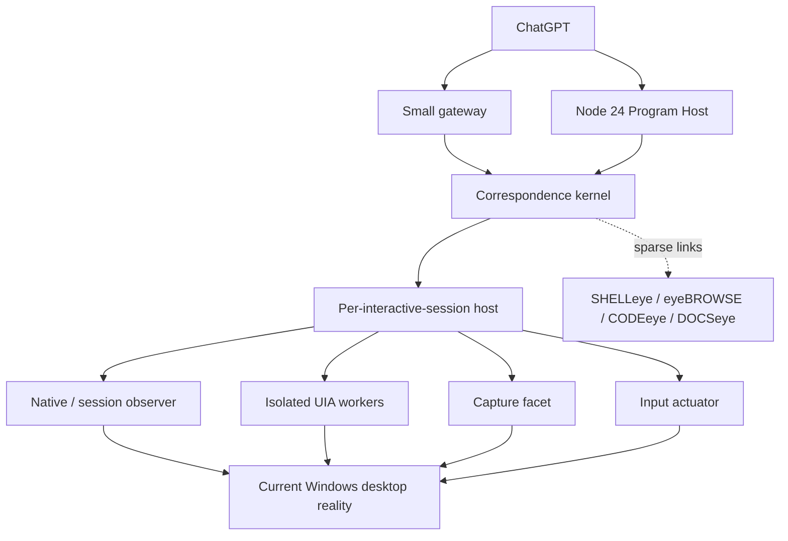

# 01 — Architecture

Status: **FINAL / SYNTHESIZED / VERIFIED / FROZEN FOR BUILD 001**
Operator: **ChatGPT**
Product implementation: **IMPLEMENTED / PENDING MEASURED ACCEPTANCE**

This is the single canonical DESKTOPeye architecture.

## 1. Definition

**DESKTOPeye is ChatGPT's persistent, sparse Windows desktop correspondence world: a restartable kernel that maintains conservative logical app, app-instance, window, dialog, control, collection, and supportable item concepts across native, accessibility, domain, visual, and input representations; emits bounded deltas and condition waits; and routes local typed programs through the strongest current representation for each operation.**

The core rule is:

> Providers own current representation-specific truth. DESKTOPeye owns conservative agent continuity across those representations.

The corresponding correctness rule is:

> Loss of continuity is acceptable. False continuity is not.

## 2. Why this architecture

Windows does not expose one authoritative, durable desktop object model:

- native windows have recyclable HWNDs and many controls are windowless;
- UIA providers expose semantic elements with provider-scoped, temporary identity;
- legacy accessibility exposes different structures and behaviors;
- domain APIs may have stronger semantic identity than UIA;
- capture exposes current pixels but not durable semantics;
- input injection targets the system input stream, not a logical concept;
- focus, visibility, capture, and pointer-interactability are different facts.

A screenshot agent repeatedly rediscovers coordinates. A UIA wrapper inherits provider identity and failure. An HWND wrapper misses windowless controls. A selector system treats reconstruction recipes as identity. A full tree mirror gives volatile provider nodes false durability. A stateless hybrid still loses correspondence and controller-death continuity.

The correspondence world accepts the complexity that is intrinsic to Windows, but keeps it sparse and evidence-bearing. It is preferred because it alone provides the combination required by ChatGPT: persistent logical references, conservative recovery, compact change, local programmability, provider isolation, and route-specific actuation semantics.

## 3. Provider authority

| Provider/substrate | Owns current truth about | Does not own |
| --- | --- | --- |
| USER32 / DWM / WTS / window-station APIs | HWND existence, process/thread association, native parent/owner, styles, show state, foreground, native focus, cloaking, frame bounds, sessions and desktops | durable user-perceived identity or windowless control semantics |
| UI Automation provider | exposed accessibility properties, patterns, views, elements, and events | universal durable element identity or complete application semantics |
| MSAA/legacy accessibility | legacy accessible objects and operations where UIA coverage is absent | canonical identity or preferred normal projection |
| Application/domain provider | documented domain objects, keys, commands, and semantics | generic desktop reality outside its contract |
| Windows Graphics Capture / other capture | pixels actually returned for a window/display capture target, frame time, dimensions, capture failures | logical identity, complete occlusion/clickability, protected content |
| Windows input APIs | accepted physical delivery attempt into an input stream | atomic delivery to a DESKTOPeye logical target |
| SHELLeye | generic process, file, service, job, machine and session concepts | perceived desktop application/window/control meaning |
| eyeBROWSE | browser targets, DOM, browser AX, network, and web-content action | native browser frame, OS dialogs and file pickers |
| CODEeye | source, symbols, diagnostics, builds, tests and engineering meaning | IDE window operation |
| DESKTOPeye | agent-facing correspondence, logical continuity, sparse relations, deltas, waits and operation routing | provider-specific current truth |

The broker uses the strongest substrate for the requested operation. It has no rigid universal fallback ladder.

## 4. Process and representation architecture



### Correspondence kernel

The kernel owns logical IDs, lifetimes, evidence, relations, interests, provider bindings, epochs, bounded deltas, waits, scoped synchronization, persistence, provider health, and operation brokerage. It must remain responsive when a UIA provider hangs.

### Per-interactive-session host

Desktop UI is session- and desktop-scoped. USER handles cannot be referenced across sessions, only one desktop in a window station receives input, and services are not the interactive UI surface. DESKTOPeye therefore requires one Session Host in every target interactive session. It observes the target input desktop, hosts native/capture/input access, and owns or supervises replaceable UIA workers.

This is a correctness boundary, not deployment theater. Build 001 targets the current interactive session only. Secure desktop, disconnected session, lock state, and inaccessible desktop are represented as Windows facts rather than worked around.

Microsoft references: [USER objects are session-scoped](https://learn.microsoft.com/en-us/windows/win32/sysinfo/user-objects), [window stations](https://learn.microsoft.com/en-us/windows/win32/winstation/window-stations), [desktops and the input desktop](https://learn.microsoft.com/en-us/windows/win32/winstation/desktops), [session notifications](https://learn.microsoft.com/en-us/windows/win32/termserv/wm-wtssession-change), [interactive services](https://learn.microsoft.com/en-us/windows/win32/services/interactive-services).

## 5. Spatial scopes

DESKTOPeye distinguishes:

1. **machine** — Windows installation and boot;
2. **logon session** — a user logon lifetime;
3. **Windows session** — WTS session namespace;
4. **window station** — USER object namespace, normally `WinSta0` for the interactive station;
5. **desktop** — window/hook namespace within the window station;
6. **input desktop** — the desktop currently receiving user input;
7. **application instance** — one live UI-bearing run/cohort;
8. **native window incarnation** — one uninterrupted HWND object lifetime;
9. **provider epoch** — one client/worker relationship to provider objects;
10. **display topology epoch** — one observed monitor/coordinate transform topology.

Crossing any relevant scope boundary invalidates bindings that depend on it.

## 6. Temporal model

DESKTOPeye does not force one global revision to represent all time.

| Clock/epoch | Meaning |
| --- | --- |
| `MachineIdentity` | current machine correlation, normally linked to SHELLeye |
| `BootEpoch` | current Windows boot, supplied/correlated by SHELLeye |
| `LogonEpoch` | current user logon lifetime |
| `SessionEpoch` | current WTS interactive-session lifetime |
| `DesktopEpoch` | observed window-station/desktop/input-desktop binding lifetime |
| `ApplicationInstanceLifetime` | one exact live app cohort |
| `WindowIncarnation` | one uninterrupted native HWND object generation when an HWND exists |
| `ProviderEpoch` | one UIA client/worker/provider-object epoch |
| `CollectionViewEpoch` | one collection ordering/filter/materialization view |
| `DisplayTopologyEpoch` | one monitor layout/DPI/transform observation |
| `WorldSequence` | monotonic order of DESKTOPeye commits only |

`WorldSequence` is not global Windows causality, a total order of provider events, or proof that no unobserved change occurred.

## 7. Logical concepts and lifetimes

Logical IDs are opaque: `app_*`, `appinst_*`, `window_*`, `dialog_*`, `control_*`, `collection_*`, and `item_*`. Provider IDs are stored only as bindings/evidence.

| Concept | Lifetime | Promotion and continuity rule |
| --- | --- | --- |
| `app_*` | installed/known application concept across restarts | package identity/AUMID, signed binary/product identity, configured domain identity, or conservative user-directed correlation; unpackaged apps may have weaker reconstruction |
| `appinst_*` | one live UI-bearing application run or multi-process cohort in one session | exact SHELLeye process incarnation/cohort plus app evidence; never crosses a genuine restart |
| `window_*` | one user-perceived window within an exact app instance | owns revisions and current native/UIA facets; may survive HWND recreation only with exact observed or domain-native lineage |
| `dialog_*` | one dialog/flyout interaction lifetime | first-class because modal ownership, sequential generations and wait semantics matter; may be a native window or a windowless facet |
| `control_*` | one promoted logical affordance under an exact window/dialog | generic `ControlType` plus patterns/facets; exact scope and evidence required for mutation |
| `collection_*` | one promoted collection/view under an exact parent | carries provider/domain identity and `CollectionViewEpoch` |
| `item_*` | one logical item only when a durable domain/app/provider key supports it | never promoted as durable from row index, container, label, geometry, or RuntimeId alone |
| focus/selection | current state relations | revisions/deltas, not durable object identity |
| visual frame | ephemeral observation | bound to capture source, frame/capture epoch, time, world cursor, bounds and transform |

Query results are ephemeral. Retaining, watching, reusing, correlating, or targeting a result promotes the minimum required concept.

### Application identity

Package identity and AUMID are strong application evidence where available, but traditional unpackaged apps may have neither. AUMID is an application association, not a live run. Electron, Office, Chromium, brokers, and other multi-process applications require a cohort relationship rather than `appinst_* = PID`.

Restart semantics are fixed:

```text
same app_*
new appinst_*
new window_*
new dialog_*/control_*/collection_*/item_* descendants
```

No control crosses an app-instance restart merely because AutomationId, path, text, or appearance matches.

Microsoft references: [AUMID purpose](https://learn.microsoft.com/en-us/windows/win32/shell/appids), [process AUMID](https://learn.microsoft.com/en-us/windows/win32/api/appmodel/nf-appmodel-getapplicationusermodelid), [packaged versus unpackaged identity](https://learn.microsoft.com/en-us/windows/apps/get-started/intro-pack-dep-proc).

## 8. Window identity and the HWND killer

An HWND is a native window incarnation witness, not a durable DESKTOPeye ID.

Microsoft documents that a USER handle remains valid until destruction, becomes invalid on destruction, is session-scoped, cannot be duplicated, and can be recycled. `IsWindow` is explicitly racy and may refer to a different window after reuse. `GetWindowThreadProcessId` reports the current creating thread/process but does not add a generation number.

References: [USER object lifetime](https://learn.microsoft.com/en-us/windows/win32/sysinfo/user-objects), [`IsWindow` recycling warning](https://learn.microsoft.com/en-us/windows/win32/api/winuser/nf-winuser-iswindow), [`GetWindowThreadProcessId`](https://learn.microsoft.com/en-us/windows/win32/api/winuser/nf-winuser-getwindowthreadprocessid), [`DestroyWindow`](https://learn.microsoft.com/en-us/windows/win32/api/winuser/nf-winuser-destroywindow).

The canonical killer is:

```text
window A → HWND H
A destroyed
window B → recycled HWND H
old window_* for A must never resolve to B
```

### Exact native incarnation witness

Within uninterrupted observation, the strongest constructed witness is:

- exact session/window-station/desktop epoch;
- HWND;
- exact SHELLeye process incarnation, not PID alone;
- creating thread ID as current corroboration;
- observed native create/destroy lineage/generation;
- current parent/owner/root-owner relations;
- class/styles and provider root as contradiction/corroboration evidence.

Only the first five can establish the current native generation; class, title, geometry, styles, owner shape, and appearance only corroborate or contradict. After an observation gap that spans possible destruction/reuse, a bare HWND cannot recover exact continuity.

No stronger documented public native generation primitive was found. Windows App SDK `WindowId`/`AppWindow` maps one-to-one to a current top-level HWND and shares its lifetime; it is a useful current facet, not a cross-HWND or anti-reuse identity upgrade. References: [AppWindow/HWND mapping](https://learn.microsoft.com/en-us/windows/apps/develop/ui/windowing-overview), [AppWindow lifetime](https://learn.microsoft.com/en-us/windows/apps/windows-app-sdk/migrate-to-windows-app-sdk/guides/windowing).

### HWND recreation

A user-perceived window can remain `window_*` while its native incarnation changes only when exact continuity is observed or supplied by a stronger domain contract, for example:

- an operation initiated from the exact old window yields the exact new native root;
- uninterrupted app/provider lineage explicitly replaces the binding;
- an application-native immutable window/document ID spans the transition;
- no competing successor exists and no contradictory replacement evidence appears.

Same title, class, geometry, owner, appearance, or process alone never proves this. Fullscreen/style/DPI/navigation/reparenting scenarios remain candidates until Build 001 measures their actual framework behavior.

## 9. UI Automation role

UIA is the default desktop semantic provider, not the identity or persistence architecture.

### Property strength

| UIA property/object | Canonical meaning |
| --- | --- |
| `AutomationElement` / `IUIAutomationElement` | live provider-facing reference within a worker/provider epoch |
| `RuntimeId` | opaque, desktop-unique at the time generated, reusable over time; incumbent/provider-incarnation witness only |
| `AutomationId` | optional, intended to be sibling-unique and language-independent where supported; query/reconstruction evidence, not universal identity |
| `Name` | current accessible label/property; candidate evidence only |
| `FrameworkId`, `ClassName`, `ControlType`, patterns | semantic/type evidence and contradiction checks |
| `NativeWindowHandle` | current HWND correlation where nonzero; many elements are windowless |

Microsoft states RuntimeIds can be reused over time and must be treated as opaque comparison values. It also states AutomationId is optional, is not guaranteed stable across application builds, and should not be assumed for other applications. References: [`GetRuntimeId`](https://learn.microsoft.com/en-us/windows/win32/api/uiautomationclient/nf-uiautomationclient-iuiautomationelement-getruntimeid), [RuntimeId SDK source](https://github.com/MicrosoftDocs/sdk-api/blob/docs/sdk-api-src/content/uiautomationclient/nf-uiautomationclient-iuiautomationelement-getruntimeid.md), [AutomationId guidance](https://learn.microsoft.com/en-us/dotnet/framework/ui-automation/use-the-automationid-property), [AutomationId property contract](https://learn.microsoft.com/en-us/dotnet/api/system.windows.automation.automationelement.automationidproperty?view=windowsdesktop-10.0).

### Live references and comparison

A surviving live UIA element reference in the same worker/apartment/provider epoch is an incumbent binding DESKTOPeye may continue to use after validating scope and availability. It is not serializable or a cold-recovery identity. `CompareElements` is documented to compare RuntimeIds, so the API does not establish a stronger durable equality contract than RuntimeId. `UIA_E_ELEMENTNOTAVAILABLE` can mean destruction or virtualization.

References: [`CompareElements`](https://learn.microsoft.com/en-us/windows/win32/api/uiautomationclient/nf-uiautomationclient-iuiautomation-compareelements), [UIA errors](https://learn.microsoft.com/en-us/windows/win32/winauto/uiauto-error-codes).

### Views

- **Control View** is the normal ChatGPT semantic projection.
- **Content View** is used for document/content-oriented queries.
- **Raw View** is used for diagnostics, recovery traversal, and provider-specific inspection.

Raw View is not the default and is never mirrored wholesale. Microsoft warns that root-descendant searches can span hundreds or thousands of elements and that tree walking is resource-intensive. Reference: [obtaining UIA elements](https://learn.microsoft.com/en-us/windows/win32/winauto/uiauto-obtainingelements).

### Scoped cache plans

Retained interests compile into narrow `CacheRequest` plans containing the properties and patterns required by observation, waits, identity checks, and expected actions. Cache results are immutable snapshots: `BuildUpdatedCache` returns a new element/cache view and does not mutate the old one. Event subscriptions attach relevant cache requests where useful.

Caching reduces cross-process calls. It is not identity, persistence, event completeness, or truth after its observation time.

References: [UIA caching](https://learn.microsoft.com/en-us/windows/win32/winauto/uiauto-cachingforclients), [`BuildUpdatedCache`](https://learn.microsoft.com/en-us/windows/win32/api/uiautomationclient/nf-uiautomationclient-iuiautomationelement-buildupdatedcache).

### Threading, event registration, and timeout behavior

UIA calls and event handlers that may touch remote UI run on non-UI MTA threads. Registration and removal follow Microsoft's apartment/thread guidance. On the target Windows generation, UIA6 event-handler groups are preferred over many individual registrations when supported.

UIA exposes a default connection timeout of two seconds and transaction timeout of twenty seconds, but a blocking call is still too dangerous for the kernel's state-management path. Provider calls execute only in replaceable worker processes. A timeout, RPC failure, worker death, or known hang marks affected bindings dirty/unavailable, emits provider health deltas, and causes worker recycling without freezing unrelated scopes.

References: [UIA threading](https://learn.microsoft.com/en-us/windows/win32/winauto/uiauto-threading), [UIA events](https://learn.microsoft.com/en-us/windows/win32/winauto/uiauto-eventsforclients), [connection timeout](https://learn.microsoft.com/en-us/windows/win32/api/uiautomationclient/nf-uiautomationclient-iuiautomation2-put_connectiontimeout), [transaction timeout](https://learn.microsoft.com/en-us/windows/win32/api/uiautomationclient/nf-uiautomationclient-iuiautomation2-get_transactiontimeout), [UIA6 handler groups](https://learn.microsoft.com/en-us/windows/win32/api/uiautomationclient/nf-uiautomationclient-iuiautomation6-addeventhandlergroup).

### Remote Operations

UIA Remote Operations can move a batch of UIA work into one provider process and reduce cross-process round trips. It is single-process scoped, execution is a blocking cross-process call, and it changes neither identity nor fault semantics. It is an optional optimization seam after correctness, not Build 001 core and never a recovery dependency.

References: [Remote Operations entry point](https://learn.microsoft.com/en-us/uwp/api/windows.ui.uiautomation.core.coreautomationremoteoperation?view=winrt-28000), [single-process import rule](https://learn.microsoft.com/en-us/uwp/api/windows.ui.uiautomation.core.coreautomationremoteoperation.importelement?view=winrt-28000), [blocking execution](https://learn.microsoft.com/en-us/uwp/api/windows.ui.uiautomation.core.coreautomationremoteoperation.execute?view=winrt-28000).

## 10. Identity evidence hierarchy

Evidence is evaluated under exact ancestors and epochs. Higher evidence is not automatically valid outside its scope.

1. **Application/domain-native immutable ID** within an exact app instance, document, dataset, or collection contract.
2. **Operation-native observed lineage** from an exact incumbent to a documented successor.
3. **Surviving exact provider binding** in the same worker/provider epoch, with current availability and unchanged exact ancestors.
4. **Exact native window incarnation**: session/desktop + HWND + exact process incarnation + create/destroy generation, where relevant.
5. **Unique conservative reconstruction** under the same exact app instance and window/dialog using a strong provider/app key, no competitor, and no contradiction.
6. **RuntimeId** as incumbent/equality evidence within the same provider epoch and exact parent scope.
7. **Documented framework/application key** within its documented scope.
8. **AutomationId** under the exact parent, combined with type/pattern evidence and uniqueness checks.
9. **Framework, class, control type, patterns, owner/parent and semantic neighborhood** as corroboration/candidate evidence.
10. **Name, value, text, tree path, row index, geometry, z-order, visual similarity, OCR, or embedding** as candidate-generation/ranking evidence only.

Exact identity requires a categorical evidence class, uninterrupted validity for its scope, and no contradiction. A bundle of weak evidence does not become exact merely because a numeric score is high. Numeric confidence may rank candidates; it may never authorize mutation.

Every `rebound_exact` result exposes the evidence class and relevant epochs. It is intentionally rare.

## 11. Identity status versus current UI state

Identity status is one of:

- `exact` — current exact incumbent binding;
- `rebound_exact` — exact correspondence reconstructed after binding loss, with evidence disclosed;
- `candidate` — one or more plausible current objects, insufficient for mutation;
- `ambiguous` — multiple non-dominated candidates or contradictory evidence;
- `stale` — retained concept lacks a valid current exact binding;
- `destroyed` — lifecycle evidence proves the concept ended;
- `unavailable` — current provider/session cannot answer;
- `virtualized` — logical item may exist but has no realized actionable representation.

Independent state dimensions include:

- `enabled` / `disabled`;
- `visible` / `hidden`;
- `onscreen` / `offscreen`;
- `cloaked` / `uncloaked`;
- `minimized` / restored;
- `occluded` / unoccluded / unknown;
- `capturable` / protected / unavailable;
- `pointer_interactable` / blocked / unknown;
- `focused`, `selected`, `modal_blocked`;
- `hung`, `provider_unhealthy`.

An exact disabled or offscreen control remains exact. An enabled candidate remains ineligible for mutation.

## 12. Dialogs

`dialog_*` is a first-class interaction concept because generation, modal ownership, lifecycle waits, and stale-action rejection matter. A dialog may be:

- a native owned/top-level window;
- a UIA modal subtree;
- a popup/flyout outside the expected control subtree;
- a custom in-window surface.

Sequential identical Confirm dialogs are different `dialog_*` generations. Concurrent identical dialogs remain distinct by exact owner/generation/representation evidence or become ambiguous. An old `OK` control never rebinds to a later identical dialog's `OK`.

## 13. Collections and virtualization

Virtualization is an identity problem, not just a discovery optimization.

Microsoft documents that virtualized items may not exist as full UIA elements; placeholders may expose only `VirtualizedItemPattern`; a subsequent search or viewport change may invalidate a placeholder; and WPF recycling reuses the same item container for different data items. References: [working with virtualized items](https://learn.microsoft.com/en-us/windows/win32/winauto/uiauto-workingwithvirtualizeditems), [ItemContainer invalidation](https://learn.microsoft.com/en-us/windows/win32/winauto/uiauto-implementingitemcontainer), [WPF container recycling](https://learn.microsoft.com/en-us/dotnet/desktop/wpf/advanced/optimizing-performance-controls).

The canonical model is:

```text
collection_*
  exact parent/application scope
  provider/domain facet
  collection_view_epoch

item_*                       only with a durable supportable key
  item key and key authority
  current representation incarnation(s)
  realized / virtualized / stale state
```

Rules:

- sort, filter, navigation, dataset replacement, and materialization changes advance the collection/view epoch as appropriate;
- row index and tree position describe a current view, never logical item identity;
- a UIA container/provider element belongs to an item representation incarnation and may be recycled;
- a domain/app-native immutable item key can let `item_*` survive representation loss and reacquire a new container;
- a provider-documented unique repeatable key may support exact continuity only within its documented exact collection scope;
- without such a key, label, index, container, RuntimeId, geometry, and visual appearance cannot promote an item to durable exact identity;
- duplicate-label items without keys remain ephemeral/ambiguous.

The primary Build 001 identity killer is:

```text
item A → container/provider element E
scroll/sort/filter/recycle
item B → reused E with duplicate visible semantics
act(old A handle)
```

Required: B is untouched. A is reacquired only through a durable key; otherwise the result is `stale`, `virtualized`, or `ambiguous`.

## 14. Representation and actuation broker

Each operation declares the capability it needs. The broker chooses a route using:

- provider authority for the requested meaning;
- exact identity quality and ancestor scope;
- semantic richness and operation fitness;
- provider health and latency;
- freshness and postcondition observability;
- focus, visibility, capture, and coordinate requirements;
- availability of a stronger sibling substrate.

Candidate routes include application/domain API, eyeBROWSE, UIA patterns, native HWND/Win32 operations, MSAA, capture/OCR/vision, clipboard, keyboard, and pointer. The broker does not fall blindly from a failed semantic operation to raw input; a different route must still meet the operation's identity and precondition contract.

### Operation assurance classes

Assurance is attached to the current operation result, not stored as concept identity and not used as an authority tier.

| Class | Meaning |
| --- | --- |
| `target_bound` | The route's API enforces a lifetime-bound native/domain object reference or immutable key at the operation boundary. A bare recyclable HWND, PID, RuntimeId, or preflight check does not qualify. It does not claim human-input-equivalent behavior or business success. |
| `provider_semantic` | A provider was asked to perform a documented semantic pattern against the current exact provider binding; provider behavior defines the effect. |
| `race_bounded_physical` | The target, focus/hit path, desktop and geometry were current at the final public preflight, but delivery is through a global physical input stream and can race afterward. |
| `delivery_uncertain` | The delivery API accepted or attempted work, but target receipt or the intended postcondition cannot be established. |

Route and postcondition evidence are returned separately. Exact logical identity does not imply equal delivery assurance across routes.

## 15. Semantic actuation

Normal preference is the strongest provider semantic operation:

- UIA `Invoke`, `Value`, `SelectionItem`, `Toggle`, `ExpandCollapse`, `Scroll`, `Window`, and `Transform` patterns;
- documented native/window messages when they actually express the intended operation;
- application/domain commands when they expose stronger object identity and meaning.

A semantic operation does not claim to reproduce the mouse/keyboard event path unless its provider contract says so. UIA semantic routes normally report `provider_semantic`. A domain/native route reports `target_bound` only when the API itself enforces a lifetime-bound reference or immutable key at the operation boundary. Passing a revalidated but recyclable HWND is not enough.

Every mutation follows:

```text
logical target
→ resolve current exact binding
→ validate exact app/window/dialog/provider scope
→ validate capability and current state
→ execute chosen route
→ reconcile declared postcondition when observable
```

Candidates, ambiguous objects, stale bindings, replaced parents, disabled operations, and provider-unhealthy targets are rejected rather than opportunistically redirected.

## 16. Pointer input

Public Windows APIs expose hit tests and input injection separately. `ElementFromPoint` returns the current UIA element at a desktop point and can race with element removal. `WindowFromPoint` returns a current visible/enabled native window with documented limitations; child-window hit testing is HWND-only and does not cover windowless controls. `SendInput` inserts events into the system mouse/keyboard stream, subject to UIPI, rather than naming a logical target.

References: [`ElementFromPoint`](https://learn.microsoft.com/en-us/windows/win32/api/uiautomationclient/nf-uiautomationclient-iuiautomation-elementfrompoint), [`WindowFromPoint`](https://learn.microsoft.com/en-us/windows/win32/api/winuser/nf-winuser-windowfrompoint), [`ChildWindowFromPointEx`](https://learn.microsoft.com/en-us/windows/win32/api/winuser/nf-winuser-childwindowfrompointex), [`SendInput`](https://learn.microsoft.com/en-us/windows/win32/api/winuser/nf-winuser-sendinput).

The strongest supported pointer protocol is:

1. resolve the exact logical target and exact app/window/provider incarnation;
2. establish input desktop and display-topology epoch;
3. query fresh clickable point/geometry and capture revision if visual routing is involved;
4. reject hidden, offscreen, minimized, cloaked, disabled, stale, ambiguous, or modal-blocked targets;
5. revalidate UIA hit test, native hit test/z-order, and relevant overlay/occlusion evidence;
6. reject disagreement, target motion, destructive overlay, or topology change;
7. inject the smallest complete gesture array;
8. reconcile the operation postcondition and report assurance.

No public API found provides an atomic `verify exact logical target + deliver pointer action to that same target` operation. New synthetic pointer/touch APIs still inject virtual-screen pixel coordinates into the desktop/system; they add modality, not target binding. Pointer injection therefore remains `race_bounded_physical` even when all preflight checks pass. Reference: [`InjectSyntheticPointerInput`](https://learn.microsoft.com/en-us/windows/win32/api/winuser/nf-winuser-injectsyntheticpointerinput).

## 17. Keyboard and focus

DESKTOPeye preserves separate facts for:

- foreground window;
- active window in a GUI thread;
- native keyboard-focus HWND;
- UIA focused element;
- caret location;
- text or item selection.

`SetForegroundWindow` is restricted and may be denied even when documented conditions appear satisfied. `SetFocus` is tied to thread input queues. UIA `SetFocus` asks the provider to focus an element. `GetGUIThreadInfo` reports active/focus/caret state with transitional limitations. `SendInput` delivers keyboard events to the foreground thread's input path and is subject to current key state and UIPI.

References: [`SetForegroundWindow`](https://learn.microsoft.com/en-us/windows/win32/api/winuser/nf-winuser-setforegroundwindow), [`SetFocus`](https://learn.microsoft.com/en-us/windows/win32/api/winuser/nf-winuser-setfocus), [UIA `SetFocus`](https://learn.microsoft.com/en-us/windows/win32/api/uiautomationclient/nf-uiautomationclient-iuiautomationelement-setfocus), [`GetGUIThreadInfo`](https://learn.microsoft.com/en-us/windows/win32/api/winuser/nf-winuser-getguithreadinfo), [`KEYBDINPUT`](https://learn.microsoft.com/en-us/windows/win32/api/winuser/ns-winuser-keybdinput).

The physical keyboard protocol is:

1. resolve exact target and exact containing app/window;
2. verify unlocked target input desktop and integrity reachability;
3. request foreground and fail `foreground_denied` if it is not actually obtained;
4. request focus through the strongest appropriate route;
5. verify foreground, native focus HWND/thread, UIA focused element where available, and modal state;
6. reject `focus_mismatch`, stale target, or competing focused scope;
7. inject the smallest complete key batch, preserving/reconciling modifier state;
8. reconcile value/state postcondition and report `race_bounded_physical` or `delivery_uncertain`.

There remains an unavoidable race after the final public focus check. Build 001 measures zero observed wrong-keyboard mutations under deterministic barrier-controlled adversaries; it does not claim a universal Windows guarantee.

## 18. Coordinates, display, visibility, and occlusion

The Session Host is per-monitor-DPI-aware. UIA bounding rectangles are physical screen coordinates but can include non-clickable/obscured points. `GetWindowRect` is DPI-virtualized and can include invisible resize borders; DWM extended frame bounds are screen-space visible frame bounds and are not DPI-adjusted. `SendInput` absolute mouse coordinates normalize to 0–65535, with `MOUSEEVENTF_VIRTUALDESK` required for the full multi-monitor virtual desktop.

References: [UIA bounding rectangle](https://learn.microsoft.com/en-us/dotnet/api/system.windows.automation.automationelement.boundingrectangleproperty?view=windowsdesktop-10.0), [`GetWindowRect`](https://learn.microsoft.com/en-us/windows/win32/api/winuser/nf-winuser-getwindowrect), [DWM attributes](https://learn.microsoft.com/en-us/windows/win32/api/dwmapi/ne-dwmapi-dwmwindowattribute), [`MOUSEINPUT`](https://learn.microsoft.com/en-us/windows/win32/api/winuser/ns-winuser-mouseinput).

DESKTOPeye retains `display_topology_epoch` and current display descriptors when pointer/capture operations need them. It does not require durable `monitor_*` concepts in Build 001. Negative virtual-desktop coordinates, monitor rotation, DPI change, window movement, and display attach/detach invalidate coordinate preflight.

Visibility is a product of distinct facts: `WS_VISIBLE`, UIA `IsOffscreen`, minimize state, DWM cloaking, computed/on-demand occlusion, capture availability, and pointer interactability. Z-order/occlusion is queried on demand for physical pointer/capture operations rather than maintained continuously.

## 19. Visual representation

Visual capture is an on-demand representation facet, not the primary world model.

### Windows Graphics Capture

WGC is the Build 001 primary per-window capture route. It can create a capture item for a current HWND and yields timestamped GPU frames. Capture support, frame arrival, resize/device loss, protected content, session state, and minimized behavior are explicit result facts. Microsoft's official sample notes that minimized windows are enumerated but not captured; Build 001 must verify exact behavior on the target build instead of treating sample behavior as an eternal OS guarantee.

References: [WGC screen capture](https://learn.microsoft.com/en-us/windows/apps/develop/media-authoring-processing/screen-capture), [`CreateForWindow`](https://learn.microsoft.com/en-us/windows/win32/api/windows.graphics.capture.interop/nf-windows-graphics-capture-interop-igraphicscaptureiteminterop-createforwindow), [official HWND capture sample](https://github.com/microsoft/Windows.UI.Composition-Win32-Samples/tree/master/cpp/ScreenCaptureforHWND), [capture protection](https://learn.microsoft.com/en-us/windows/win32/api/winuser/nf-winuser-setwindowdisplayaffinity).

### Other routes

- **Desktop Duplication** represents composed monitor/output truth and pointer metadata. It is a later/fallback route, not Build 001 core.
- **PrintWindow** is a blocking request for the target application to render into a DC; it can hang or differ from current composed pixels and is only a guarded fallback.
- **BitBlt/screen DC** captures current screen pixels including occlusion/overlay for a requested region, useful for pointer truth but not hidden-window semantics.

References: [Desktop Duplication](https://learn.microsoft.com/en-us/windows/win32/direct3ddxgi/desktop-dup-api), [`PrintWindow`](https://learn.microsoft.com/en-us/windows/win32/api/winuser/nf-winuser-printwindow), [`BitBlt`](https://learn.microsoft.com/en-us/windows/win32/api/wingdi/nf-wingdi-bitblt).

### Frame and vision rules

A frame reference carries source window/region and native incarnation, capture epoch, provider timestamp, world cursor, pixel dimensions, bounds/transform, display topology epoch, and limitations. Frames are ephemeral and are not stored as a permanent screenshot stream.

OCR is a fallback when authoritative accessible/domain text is absent. Visual similarity, OCR, and embeddings may discover/rank candidates but cannot alone establish exact retained identity.

## 20. Sparse observation and event authority

Sparse does not mean globally blind.

### Cheap session-wide layer

The Session Host maintains low-cost native observation for top-level window create/destroy/show/hide/cloak/location, foreground, focus, menu/dialog/popup signals, desktop/session transitions, and relevant display change. `SetWinEventHook` can cover all processes on the current desktop out of context; callbacks enqueue compact signals only.

References: [`SetWinEventHook`](https://learn.microsoft.com/en-us/windows/win32/api/winuser/nf-winuser-setwineventhook), [WinEvent constants and documented inconsistencies](https://learn.microsoft.com/en-us/windows/win32/winauto/event-constants).

### Sparse deep layer

Deep UIA subscriptions/cache plans are established only for retained/watch/action scopes. Focus or unexpected modal/top-level signals may promote a bounded inspection scope.

### Event authority rule

> Events mark relevant state dirty. Current scoped provider queries establish current truth.

Events can be missing, coalesced, inconsistent, duplicated, late, reentrant, or delivered after replacement. They are wake-up/lifecycle evidence, not a complete event history. Old-epoch events are discarded after causing an explicit gap/reconciliation requirement.

## 21. Delta model

Every committed logical change receives a `WorldSequence`. Default output is compact and interest-scoped.

Delta classes include:

- application/app-instance lifecycle;
- window/native-incarnation lifecycle;
- dialog lifecycle/modal relation;
- control lifecycle and provider binding;
- focus, caret and selection;
- value/text, enabled, visibility and geometry;
- collection/view epoch and item representation;
- virtualization/realization;
- provider health/restart;
- display/capture/visual invalidation;
- session/desktop transition;
- `gap` and reconciliation boundaries.

Delta retention is bounded by count/bytes/time. Cursors expire. A consumer requesting an expired or discontinuous cursor receives an explicit gap descriptor containing affected scopes and the required scoped resnapshot/sync. There is no permanent event or action ledger.

## 22. `world.sync`

Canonical definition:

> Reconcile retained/current interests within a requested scope against current native, UIA, domain, session, and visual state as applicable; commit the resulting logical deltas; and return the new world cursor plus any unresolved provider state.

It does not mean:

- the whole desktop is idle;
- all Windows events were observed;
- nothing will change after return;
- a perfect causal barrier exists;
- all applications were traversed;
- a separate verification stage ran.

## 23. Condition waits

Build 001 wait classes include:

- application/app-instance exists or exits;
- window/dialog/control exists, closes, or disappears;
- enabled/disabled, visible/offscreen, focus and modal state;
- value/text predicate;
- selection/item predicate and collection/view epoch change;
- menu/flyout/popup lifecycle;
- provider healthy/unhealthy/restarted;
- capture/visual predicate where deterministic;
- session/desktop transition;
- explicit `stable_for` debounce.

Wait algorithm:

```text
query current predicate
→ if false, establish/retain scoped interest and subscriptions
→ wake on native/UIA/domain/timer/provider signals
→ targeted reconciliation; bounded poll fallback where signals are incomplete
→ final current predicate query
→ return satisfaction cursor/evidence or typed timeout/unavailability
```

Fixed sleeps are never correctness. Event silence is never semantic idle.

## 24. Persistence

SQLite WAL is sufficient for Build 001. A graph database has no demonstrated requirement.

Persist:

- logical concepts and lifecycle status;
- app/window/control/item incarnations and provider bindings;
- identity evidence and exact ancestor scopes;
- epochs and sparse relations;
- retained interests and cache-plan intent;
- bounded delta/cursor metadata and explicit gaps;
- provider-health/recovery metadata needed for current operation.

Do not persist:

- the complete UIA tree;
- every provider event;
- screenshots/video streams;
- every action or action receipt;
- all text ranges, menu items, tooltips, or unretained rows;
- similarity scores as mutation authority.

Persistence means preservation or conservative retirement of correspondence, not survival of applications.

## 25. Recovery

### Gateway restart

The gateway is stateless. Logical world, waits and provider hosts continue.

### Warm kernel recovery

If the kernel restarts while the Session Host/UIA coordination process survives, same-epoch live provider bindings may remain incumbent evidence. The new kernel establishes a gap, validates provider/session epochs and exact scopes, then continues only bindings proven current.

### Cold recovery

If kernel and UIA workers die while applications remain:

1. create a new provider epoch;
2. emit an explicit observation/recovery gap;
3. enumerate current session/native top-level reality;
4. correlate exact `appinst_*` only through SHELLeye/domain process-incarnation evidence;
5. reconstruct windows only from exact surviving lifetime/lineage evidence available across the gap;
6. reconstruct controls/items only from strong unique keys under exact recovered ancestors;
7. mark all other retained descendants `stale`, `ambiguous`, `destroyed`, `unavailable`, or `virtualized` as evidence permits;
8. reconstruct current focus/modal/selection state as new current state, not as complete history;
9. commit recovery deltas and return the post-recovery cursor.

Cold recovery is the decisive gate because UIA COM references and RuntimeIds do not survive as durable identities.

### Epistemic limit

If DESKTOPeye is absent while control A is destroyed and indistinguishable B is created, and Windows exposes no durable external generation/key, exact continuity is unknowable. DESKTOPeye must not manufacture certainty. This limit also applies to generic windows after an unobserved HWND destruction/reuse possibility and to unkeyed collection items after recycling.

### Provider restart

`same control_* → new UIA binding` may be `rebound_exact` only when the same exact app instance and logical window survive, a strong unique reconstruction witness exists, no competing candidate exists, and no replacement contradiction exists. RuntimeId/AutomationId/name/path similarity alone cannot do this.

## 26. Provider fault isolation

Frozen requirement:

> UIA provider failure must not freeze the correspondence kernel or unrelated application scopes.

Build 001 starts with:

- a stable per-session native observer;
- a stable UIA coordination/event-registration MTA;
- replaceable UIA query/operation worker process lane(s);
- hard broker-side deadlines and worker recycling;
- provider/app affinity only where measurement supports it.

The exact count—single disposable worker, pool, app-affine pool, or per-app worker—is deferred to the smallest Build 001 hang experiment. The interface and health model must permit all of them. Isolation may cost cross-worker caching; that is preferable to a provider hang freezing the world.

## 27. Program Host

Node 24 remains the Program Host language because it is already available on STEALTHEYELLC, is proven in sibling StealthEye substrates, has low typed-API orchestration friction, and offers no material disadvantage that justifies a new runtime.

The host:

- is a separate local process with no model inside;
- receives one ChatGPT-authored program;
- exposes typed DESKTOPeye operations and opaque logical IDs;
- performs local waits, branches, loops, calculations and compact aggregation;
- streams/returns only bounded semantic results and requested visual payloads;
- cannot bypass brokered identity/action rules with arbitrary UIA, PowerShell, Win32, or coordinate macros.

Build 001 hard floor is **at least 40 meaningful typed operations in one invocation**, target **50+**, with no padding and at least 90% of workflow operations expressed through the typed SDK. The canonical workflow plans 60 typed calls. This deliberately sits above eyeBROWSE's demonstrated 33-operation workflow, around CODEeye's 45, and near SHELLeye's 52 while requiring a more heterogeneous desktop path.

## 28. Cross-substrate routing

### eyeBROWSE

eyeBROWSE owns browser targets, DOM, browser AX, network, and web-content actions. DESKTOPeye owns the native browser frame, OS window/focus, native chrome not exposed by the browser target, file pickers, OS dialogs, and desktop input fallback. Electron/Chromium content uses eyeBROWSE when a browser-native target exists; visibility through UIA does not make UIA the stronger route.

### SHELLeye

SHELLeye owns generic process lifetime/launch, filesystem, services/jobs, and machine/session truth. DESKTOPeye links `appinst_*` to an exact SHELLeye `proc_*` or process cohort and owns the perceived application/window/control state.

### CODEeye and DOCSeye

DESKTOPeye can operate IDE/document UI. CODEeye still owns engineering semantics. A future DOCSeye owns document meaning while DESKTOPeye may own the document window, viewport, scroll and visible selection UI.

Only sparse explicit correlation links are created. No universal StealthEye world database is introduced.

## 29. Rejected alternatives

| Alternative | Decisive failure |
| --- | --- |
| Screenshot/vision-first | repeated coordinate rediscovery, weak durable identity, poor compact deltas and recovery |
| UIA wrapper | provider identity/failure becomes product identity/failure; no native/visual/domain continuity |
| HWND/Win32-first | recyclable handles and weak windowless/custom-control semantics |
| Selector-centered RPA | reconstruction recipe is mistaken for retained identity; weak cold recovery/virtualization semantics |
| Full accessibility-tree mirror | provider volatility, virtualization, startup/recovery cost, context density and false durability |
| Stateless UIA + screenshot + input | coverage without retained continuity, bounded change, or controller-death recovery |
| Application-plugin federation | strong in covered domains but a plugin zoo with no generic desktop correspondence |
| Graph/universal world database | no demonstrated need; couples sibling truth and adds coherence cost |

The adopted architecture can still use vision, UIA, HWNDs, selectors as ephemeral queries, and application plugins. It refuses to make any one of them the universal identity system.

## 30. Falsification results and hard limits

The architecture survived these strongest attacks:

1. **No universal durable control IDs.** The model makes continuity evidence-categorical and permits loss.
2. **Correspondence is complex.** Sparse promotion, exact ownership boundaries, and no global tree/database constrain the complexity to operationally useful objects.
3. **Sparse observation can miss UI.** The cheap session-wide native layer detects unexpected top-level/modal/focus changes and triggers bounded discovery.
4. **Worker isolation costs performance.** Cache plans, a stable event lane, and optional app affinity/Remote Operations recover performance without putting provider calls on the kernel path.
5. **Physical input is not atomically bound.** Assurance and metrics say so explicitly; semantic routes are preferred.
6. **Domain providers can become a plugin zoo.** They are optional operation-specific facets behind one broker, not the desktop architecture.
7. **Semantic actions differ from human input.** Route and assurance are returned; physical input remains available when the event path matters.
8. **Vision keeps improving.** Better visual models improve candidate discovery and custom-surface coverage but do not create durable external generation keys.
9. **A full tree looks simpler.** It moves complexity into invalidation, virtualization, false identity, provider hangs, storage and model context; it does not remove it.

Public documentation reviewed did not reveal a system exposing the full combination of provider-independent retained desktop concepts, conservative cold recovery, bounded semantic deltas, condition waits, multi-representation actuation, and a many-operation local Program Host. This is a statement about reviewed public documentation, not a claim about private systems.

## 31. Frozen technical baseline

- kernel: C# / .NET 10 x64;
- UIA foundation: direct native COM `IUIAutomation*`, including exact HRESULTs, caching, events, timeout interfaces, UIA6 groups where supported, and a Remote Operations seam;
- native: USER32, DWM, WTS, WinEvent and display/DPI APIs through managed interop;
- capture: Windows Graphics Capture primary for per-window Build 001 capture;
- persistence: SQLite WAL;
- IPC: local Windows named pipes with a compact versioned typed protocol;
- Program Host: Node 24;
- legacy MSAA: fallback seam, not core;
- C++/Rust/native helper: none by default; allowed later only for a measured capability gap;
- injection/driver: no DLL injection, universal target instrumentation, or kernel driver.

Direct COM is preferred over `System.Windows.Automation`, FlaUI, and other wrappers for the identity-critical provider because Build 001 requires current interfaces, caches, exact errors, timeouts, event groups, and optional Remote Operations. Wrappers remain references or non-critical conveniences.

## 32. Freeze marker

```text
Architecture:           FINAL / SYNTHESIZED / VERIFIED / FROZEN FOR BUILD 001
Build 001:              IMPLEMENTED / PENDING MEASURED ACCEPTANCE
Product implementation: IMPLEMENTED / PENDING MEASURED ACCEPTANCE
Build 001 acceptance:   NOT RUN
```
